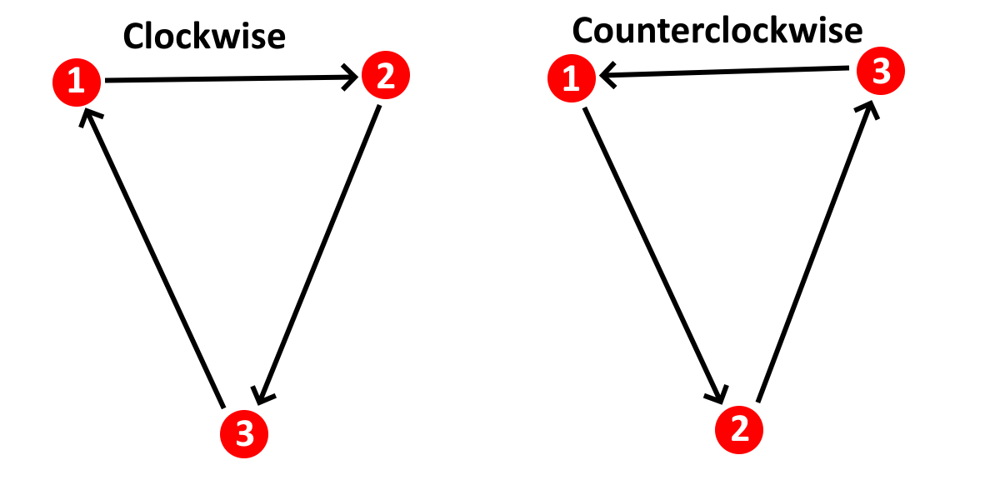

## The Problem

When rendering 3D meshes, you often want to avoid rendering triangles that you don't need to render. Consider the rendering engine below:



settings @{
viewport: @{ xmin: -2, ymin: -2, xmax: 2, ymax: 2 },
};

CameraX = 0;
CameraY = 0;
CameraZ = 0;

folder "Internals" {

XVertexPositionsModelSpace = [-1, 1, -1, 1, -1, 1, -1, 1] + 1.3;
YVertexPositionsModelSpace = [-1, -1, 1, 1, -1, -1, 1, 1] + 1.5;
ZVertexPositionsModelSpace = [-5, -5, -5, -5, -7, -7, -7, -7];

XVertexPositionsViewSpace = XVertexPositionsModelSpace - CameraX;
YVertexPositionsViewSpace = YVertexPositionsModelSpace - CameraY;
ZVertexPositionsViewSpace = ZVertexPositionsModelSpace - CameraZ;

ScreenSpacePoints = (XVertexPositionsViewSpace, YVertexPositionsViewSpace) / -ZVertexPositionsViewSpace @{ hidden: true };

IndicesP1 = [1, 2, 3, 7, 1, 2, 1, 5, 2, 6, 5, 6];
IndicesP2 = [2, 4, 7, 4, 2, 5, 5, 3, 4, 4, 6, 8];
IndicesP3 = [3, 3, 4, 8, 5, 6, 3, 7, 6, 8, 7, 7];

UnsortedPolygons = polygon(ScreenSpacePoints[IndicesP1], ScreenSpacePoints[IndicesP2], ScreenSpacePoints[IndicesP3]) @{ hidden: true };

VertexDistances = sqrt(XVertexPositionsViewSpace^2 + YVertexPositionsViewSpace^2 + ZVertexPositionsViewSpace^2);

PolygonAverageDist = (VertexDistances[IndicesP1] + VertexDistances[IndicesP2] + VertexDistances[IndicesP3]) / 3;

Colors = sort(hsv([30,60...360], 1, 1), -PolygonAverageDist);

sort(UnsortedPolygons, -PolygonAverageDist) @{
fill: 1,
color: Colors,
lines: @{ width: 0 }
}

} @{ collapsed: true };



This engine is rendering a cube composed of 12 triangles making up its six square faces. However, we should only actually _see_ six faces of the cube. The other six should be currently hidden from view. Why render these polygons if they shouldn't be visible anyway? If we got rid of them, we could speed up rendering. This might not be such a big deal for a _cube_, but for a more complicated model it could mean the difference between 15 and 30 FPS.

Furthermore, look at how the cube looks right now. Under certain circumstances&mdash; despite the fact that we've implemented depth sorting in this engine&mdash; it isn't _perfect_: Some polygons still appear in the wrong order regardless. Getting rid of these wrongly-ordered polygons would mitigate this issue.

## The Solution

The solution to this issue is to implement **Backface Culling**. The underlying idea of backface culling is the observation that _most meshes are "solid" objects with one side facing toward the camera and another side facing away from the camera, allowing us to safely discard any faces that are facing away_. These faces which are facing _away_ are known as "backfaces."

There are two main schools of thought when implementing backface culling, which I'll call the "Normal Dot Product" method and the "Winding Order" method. While both methods are quite fast and simple, they each have their trade-offs.

### Commonalities Between Both Methods

Both methods build on the same scaffolding: We are filtering the list of polygons to be drawn, removing all of the backfaces. Be careful when doing this&mdash; it will need to play nicely with depth sorting and any other filtering operation (e.g. frustum culling) that you perform on your scene. You'll also need to cull the mesh colors so that they remain 1:1 with the polygons.

### The Normal Dot Product Method

If you have [face normals](<https://en.wikipedia.org/wiki/Normal_(geometry)>) available for your mesh, this method may be for you. As a tl;dr, a face normal is a unit vector which is perpendicular to a face in a mesh. Crucially, it also points in the direction _outside_ of the mesh. This is important if you want to, say, render the outside of the box, versus the inside of a cube-shaped room. For a box, you want the normals to point outward; for a room, you want the normals to point inward.

In other words, a face normal is a compact way of describing the _orientation_ of a face, which is exactly what we need. In order to detect whether a face is a backface using its normal, we can also define what I'll call a "camera vector": a vector pointing from the camera to one of the points in the triangle (doesn't matter which one).

You can infer then that if the face normal and the camera vector are facing _toward_ one another (i.e. are pointing in _opposite_ directions), then the face is _not_ a backface and should stay. Conversely, if the face normal and camera vector are facing in the _same_ direction, then the face _is_ a backface and should be removed.

We can tell whether these vectors are pointing in the same direction (and therefore should be culled) by taking their dot product. If two vectors have an angle of less than 180 degrees, then their dot product is positive, and thus should be culled. Thus, a polygon should stay in the list _if and only if_ this dot product is negative. In other words, given the definition of a dot product, we can use this as our list filter:



Note that the triangle coordinates can be on any point on the triangle, including one of its vertices.

### The Winding Order Method

The Winding Order Method is nice because it doesn't require face normals, which often have to be computed after-the-fact and don't play as nicely with rotated and/or transformed models. That being said, it may be slightly slower in the absence of these advantages (though this is debatable&mdash; Desmos performance is largely a mystery!).

This method relies on the assumption that all polygons in the mesh have the same _winding order_ when rendered. The "winding order" of a polygon describes whether its vertices are given in clockwise or counterclockwise order:

Importantly, the winding order of a polygon changes as soon as you flip it over. You can easily demonstrate this by taking a sheet of paper, drawing a bunch of arrows in a circle (or triangle like above) in a thick marker, and then flipping it over. You'll see that the arrows change direction&mdash; clockwise to counterclockwise, or vice-versa. What this means is that you can define the "front face" of a triangle by intentionally choosing its winding order when it's projected to 2D. For instance, you could arbitrarily say that any counterclockwise polygon is considered to be facing toward the camera. Therefore, if you were to see that a face is clockwise, you know that it's a backface and therefore must be culled.

This might seem like an annoying technique to set up as it requires careful control over polygons. However, most 3D software today is _designed_ to have this level of control when outputting meshes, because many if not all graphics APIs have backface culling _built in_ using this exact method.

How do we determine winding order? The answer is less complicated than you might expect. Consider one edge of a triangle. This edge has a definite _start_ vertex and a definite _end_ vertex, since we care about the order in which vertices are laid out to determine winding order. These vertices are 2D, since, again, winding order only really makes sense once we project 3D coordinates onto 2D space. Let's define the starting vertex as  and the end vertex as .

To get the "contribution" to the winding order from this edge, we calculate . We then repeat this for every other edge in the polygon, and sum all the results together. Assuming the third vertex in the triangle is defined as , the total winding order of a triangle is therefore as follows:



What does this number actually _mean_ though? Long story short, if it's negative, the polygon is counterclockwise. If it's positive, it's clockwise. So, in other words, if you're culling clockwise polygons (which appears to be more standard), you only keep the polygons for which this winding order equation is _negative_.
