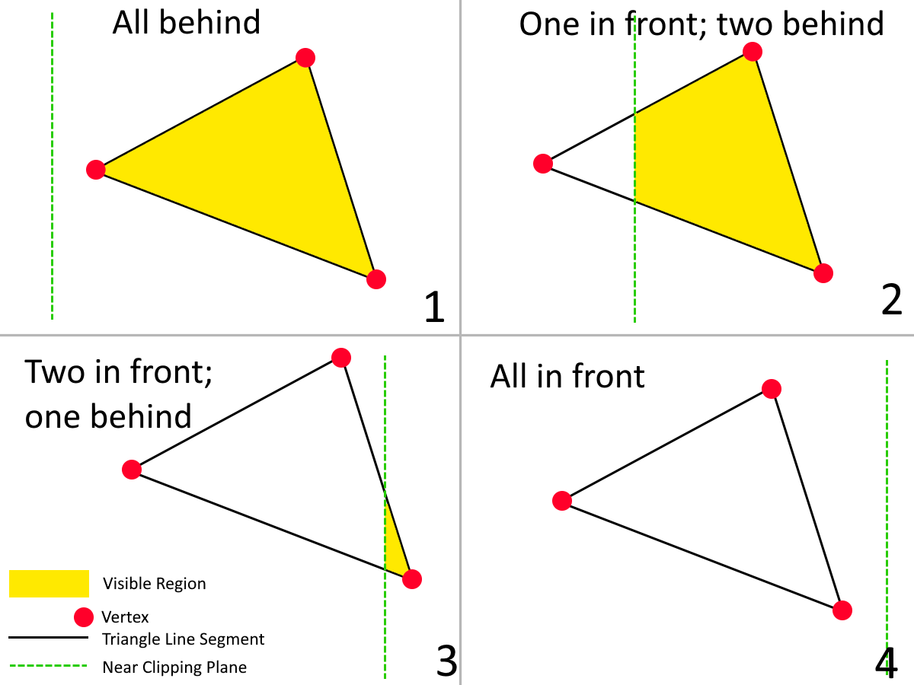
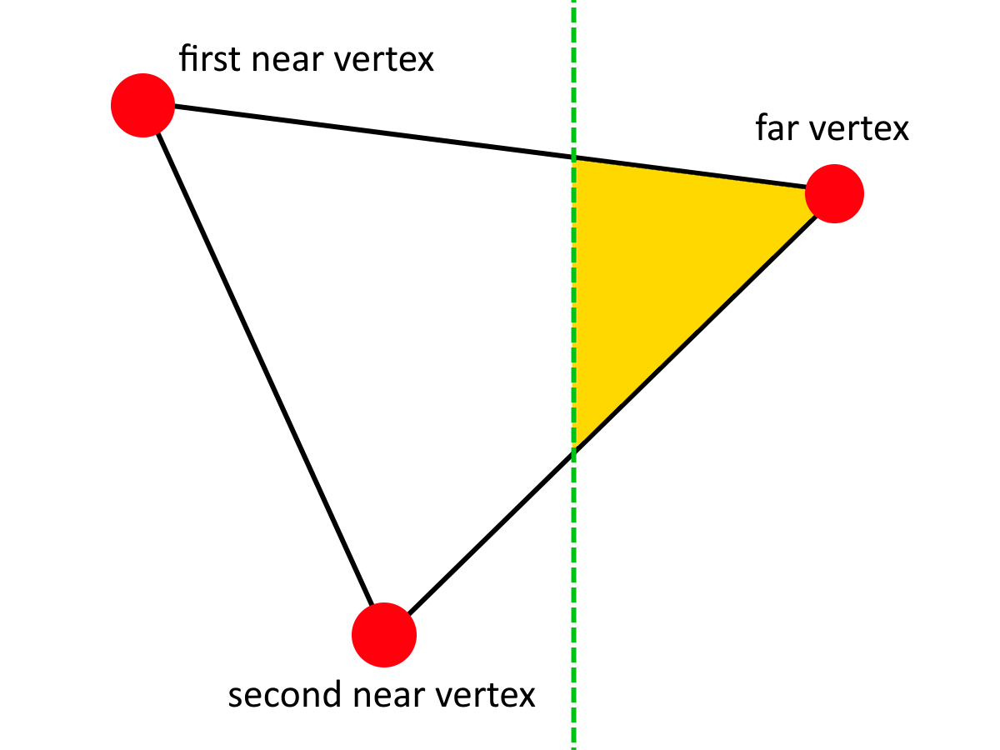
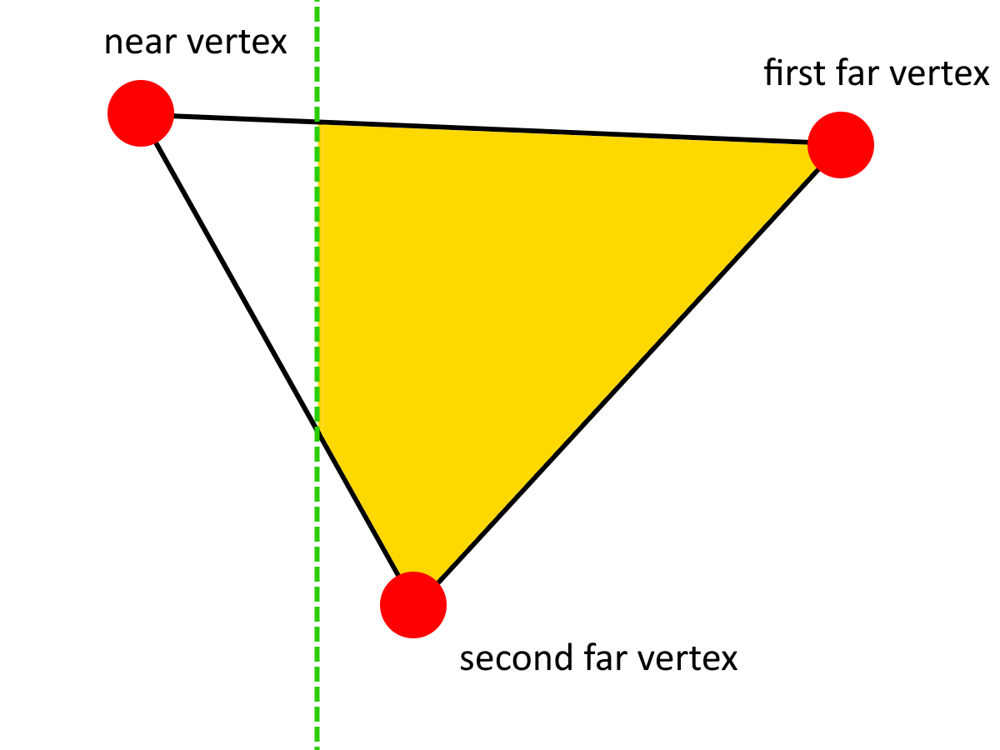

If you've ever messed around with 3D rendering in Desmos, you almost certainly will have encountered this issue:



settings @{
viewport: @{ xmin: -2, ymin: -2, xmax: 2, ymax: 2 },
};

CameraX = 0;
CameraY = 0;
CameraZ = 0 @{ slider: @{ playing: true, min: -8, max: -3 }};

folder "Internals" {

XVertexPositionsModelSpace = [-1, 1, -1, 1, -1, 1, -1, 1] + 1.3;
YVertexPositionsModelSpace = [-1, -1, 1, 1, -1, -1, 1, 1] + 1.5;
ZVertexPositionsModelSpace = [-5, -5, -5, -5, -7, -7, -7, -7];

XVertexPositionsViewSpace = XVertexPositionsModelSpace - CameraX;
YVertexPositionsViewSpace = YVertexPositionsModelSpace - CameraY;
ZVertexPositionsViewSpace = ZVertexPositionsModelSpace - CameraZ;

ScreenSpacePoints = (XVertexPositionsViewSpace, YVertexPositionsViewSpace) / -ZVertexPositionsViewSpace @{ hidden: true };

IndicesP1 = [1, 2, 3, 7, 1, 2, 1, 5, 2, 6, 5, 6];
IndicesP2 = [2, 4, 7, 4, 2, 5, 5, 3, 4, 4, 6, 8];
IndicesP3 = [3, 3, 4, 8, 5, 6, 3, 7, 6, 8, 7, 7];

UnsortedPolygons = polygon(ScreenSpacePoints[IndicesP1], ScreenSpacePoints[IndicesP2], ScreenSpacePoints[IndicesP3]) @{ hidden: true };

VertexDistances = sqrt(XVertexPositionsViewSpace^2 + YVertexPositionsViewSpace^2 + ZVertexPositionsViewSpace^2);

PolygonAverageDist = (VertexDistances[IndicesP1] + VertexDistances[IndicesP2] + VertexDistances[IndicesP3]) / 3;

Colors = sort(hsv([30,60...360], 1, 1), -PolygonAverageDist);

sort(UnsortedPolygons, -PolygonAverageDist) @{
fill: 1,
color: Colors,
lines: @{ width: 0 }
}

} @{ collapsed: true };



## What's Causing This?

This problem is caused by the renderer trying to render vertices which are _behind the camera_. Due to the perspective projection, the vertices' X- and Y-coordinates are divided by their Z coordinates (multiplied by -1 to keep the coordinate system right-handed) to make the triangles appear smaller and closer to the center when they are far away. When the Z coordinate is the wrong sign, the X and Y coordinates' signs are _flipped_ when they are divided, causing them to appear on the opposite side. When vertices in a triangle have different signs, this effect causes massive triangles to tear across the screen. And really, we shouldn't have anything rendering like this in the first place.

## How do we fix it?

The solution to this problem is to implement _Near Plane Clipping_. The **Near Plane** is a 3D plane close to the front of the camera which is usually parallel to its surface. When rendering, any geometry that goes past the near clipping plane does not appear. A reasonable near plane in most Desmos-based 3D renderers could be defined by the equation , since a  value of -0.05 represents something 0.05 units in front of the camera.

### A simple solution

The conceptually simplest way to apply a technique like this would be to delete any triangle with a Z-value greater than that which the near clipping plane defines as the cutoff. However, many of you can probably already anticipate the problem with this: If only _one_ vertex of a triangle goes past the cutoff, the _entire thing_ is going to disappear abruptly! We could mitigate this by decreasing the opacity of nearby triangles, but even _this_ is a bandaid solution, albeit a nice one if you're strapped for time. We can do better.

## Pixel-Perfect Near Plane Clipping

To get Near Plane Clipping working properly, we have to consider what the Near Plane is even _doing_ to the polygons. In a way, it's a bit like a knife, cutting through polygons and discarding the half that's closer to the camera.

How does it do this? There are four important cases here:

1. All of the vertices are behind the near clipping plane, and thus the entire triangle is visible.
2. One of the vertices is in front of the near clipping plane and the other two are behind it, creating a new quadrilateral.
3. Two of the vertices are in front of the near clipping plane and the third is behind it, creating a new triangle.
4. All of the vertices are in front of the near clipping plane, making the entire triangle invisible.

### Which vertices are in front of the near clipping plane?

How do we calculate what case to pursue? Let's assume that we've defined three variables for the X, Y, and Z positions of the vertices in a triangle. We'll call them , , and . They are all three-element lists. We'll also define a variable  which is equal to the cutoff value for our near clipping plane. As a reminder, any value _greater than_  is to be clipped.

Any vertex can be either in in front of or behind the near clipping plane, giving us two possibilities per vertex, with three vertices total. This gives us  possibilities in total. It'd be annoying to hardcode all of these, so is there a way to generalize this?

One possible solution is to use list filters. With the filter , we can get a list of all the X-coordinates that are _behind or on_ the near clipping plane. Similarly, we can use  to get all X-coordinates _in front of_ the near clipping plane. We can then rinse and repeat with the rest of the axes to get filtered lists of points in front of and behind the near clipping plane. But more importantly, we can use one of these filtered lists to decide how many points are in front of the near clipping plane and therefore figure out whether we need to use Case 1, Case 2, Case 3, or Case 4.

### Cases 1 & 4

Cases 1 and 4 are the simplest: For 1, we render the triangle normally, and for 4, we disregard it entirely, rendering an empty polygon with no vertices instead. Cases 2 and 3 are where things get weird.

### Case 3

#### Finding the new vertices

Let's start with case 3, since triangles tend to be easier to work with than quads, and 3 produces a triangle. The difficulty comes in the fact this triangle isn't our original triangle: Two of its vertices are entirely new, and we need to find out where they're located. First, some definitions of the vertices of the _original triangle_ (pre-clipping) to avoid confusion:

- Let's call the coordinates of the first vertex in front , , and .
  - Altogether I'll call this the "first near vertex"
- Let's call the coordinates of the second vertex in front , , and .
  - Altogether I'll call this the "second near vertex"
- Let's call the coordinates of the first vertex behind , , and .

  - Altogether I'll call this the "far vertex"

  

With all of this said, the two new vertices are defined as follows:

1. The _point_ on the line segment connecting the _first near vertex_ and the far vertex where .
2. The _point_ on the line segment connecting the _second near vertex_ and the far vertex where .

Let's consider the first of these points&mdash; the one on the segment connecting the _first near vertex_ and the _far vertex_. We can represent this line segment as a 3D parametric equation where  ranges from 0 to 1:







Then to find the -value where , we need to solve the  equation for  after setting it equal to :







Now that we have , we can plug it back into the other two equations in the parametric to get the X and Y coordinates of the first new point.

We then repeat the process for the _other_ point. This is essentially the same operation, but with one of the endpoints of the line segment changed.

And now that we have these two points, we can connect them together with the _far vertex_ and render the resulting triangle.

### Case 2

The process for Case 2 is virtually identical. I'll let you derive it on your own, with the help of this picture.

Just make sure to render the points of the quadrilerateral in the _correct order_, otherwise the quadrilateral will look like this, which you _don't_ want:



polygon((5,5),(-5,-5),(-5,5),(5,-5));



## The End Result

Here is a full implementation of near plane clipping as described above:



settings @{
viewport: @{ xmin: -2, ymin: -2, xmax: 2, ymax: 2 },
};

NearClippingPlaneZ = -0.25;
CameraX = 0;
CameraY = 0;
CameraZ = 0 @{ slider: @{ playing: true, min: -8, max: -3 }};

folder "Near Plane Clipping" {
xs = [x1, x2, x3];
ys = [y1, y2, y3];
zs = [z1, z2, z3];

xInFront = xs[zs > ZNear];
yInFront = ys[zs > ZNear];
zInFront = zs[zs > ZNear];
xBehind = xs[zs <= ZNear];
yBehind = ys[zs <= ZNear];
zBehind = zs[zs <= ZNear];

t1case3 = (ZNear - zBehind[1]) / (zInFront[1] - zBehind[1]);
t2case3 = (ZNear - zBehind[1]) / (zInFront[2] - zBehind[1]);

x1case3 = xBehind[1] + (xInFront[1] - xBehind[1]) \* t1case3;
y1case3 = yBehind[1] + (yInFront[1] - yBehind[1]) \* t1case3;
z1case3 = zBehind[1] + (zInFront[1] - zBehind[1]) \* t1case3;

x2case3 = xBehind[1] + (xInFront[2] - xBehind[1]) \* t2case3;
y2case3 = yBehind[1] + (yInFront[2] - yBehind[1]) \* t2case3;
z2case3 = zBehind[1] + (zInFront[2] - zBehind[1]) \* t2case3;

t1case2 = (ZNear - zBehind[1]) / (zInFront[1] - zBehind[1]);
t2case2 = (ZNear - zBehind[2]) / (zInFront[1] - zBehind[2]);

x1case2 = xBehind[1] + (xInFront[1] - xBehind[1]) \* t1case2;
y1case2 = yBehind[1] + (yInFront[1] - yBehind[1]) \* t1case2;
z1case2 = zBehind[1] + (zInFront[1] - zBehind[1]) \* t1case2;

x2case2 = xBehind[2] + (xInFront[1] - xBehind[2]) \* t2case2;
y2case2 = yBehind[2] + (yInFront[1] - yBehind[2]) \* t2case2;
z2case2 = zBehind[2] + (zInFront[1] - zBehind[2]) \* t2case2;

getClippedPolygon(
ZNear, x1, y1, z1, x2, y2, z2, x3, y3, z3
) = {
length(xBehind) = 3: polygon((x1/-z1,y1/-z1), (x2/-z2, y2/-z2), (x3/-z3, y3/-z3)),
length(xBehind) = 2: polygon(
(xBehind[2] / -zBehind[2], yBehind[2] / -zBehind[2]),
(xBehind[1] / -zBehind[1], yBehind[1] / -zBehind[1]),
(x1case2 / -z1case2, y1case2 / -z1case2),
(x2case2 / -z2case2, y2case2 / -z2case2)
),
length(xBehind) = 1: polygon(
(xBehind[1] / -zBehind[1], yBehind[1] / -zBehind[1]),
(x1case3 / -z1case3, y1case3 / -z1case3),
(x2case3 / -z2case3, y2case3 / -z2case3)
),
length(xBehind) = 0: polygon()
};
};

folder "Internals" {

XVertexPositionsModelSpace = [-1, 1, -1, 1, -1, 1, -1, 1] + 1.3;
YVertexPositionsModelSpace = [-1, -1, 1, 1, -1, -1, 1, 1] + 1.5;
ZVertexPositionsModelSpace = [-5, -5, -5, -5, -7, -7, -7, -7];

XVertexPositionsViewSpace = XVertexPositionsModelSpace - CameraX;
YVertexPositionsViewSpace = YVertexPositionsModelSpace - CameraY;
ZVertexPositionsViewSpace = ZVertexPositionsModelSpace - CameraZ;

ScreenSpacePoints = (XVertexPositionsViewSpace, YVertexPositionsViewSpace) / -ZVertexPositionsViewSpace @{ hidden: true };

IndicesP1 = [1, 2, 3, 7, 1, 2, 1, 5, 2, 6, 5, 6];
IndicesP2 = [2, 4, 7, 4, 2, 5, 5, 3, 4, 4, 6, 8];
IndicesP3 = [3, 3, 4, 8, 5, 6, 3, 7, 6, 8, 7, 7];

UnsortedPolygons = [getClippedPolygon(
NearClippingPlaneZ,
XVertexPositionsViewSpace[IndicesP1[i]],
YVertexPositionsViewSpace[IndicesP1[i]],
ZVertexPositionsViewSpace[IndicesP1[i]],
XVertexPositionsViewSpace[IndicesP2[i]],
YVertexPositionsViewSpace[IndicesP2[i]],
ZVertexPositionsViewSpace[IndicesP2[i]],
XVertexPositionsViewSpace[IndicesP3[i]],
YVertexPositionsViewSpace[IndicesP3[i]],
ZVertexPositionsViewSpace[IndicesP3[i]]
) for i=[1...length(IndicesP1)]] @{ hidden: true };

VertexDistances = sqrt(XVertexPositionsViewSpace^2 + YVertexPositionsViewSpace^2 + ZVertexPositionsViewSpace^2);

PolygonAverageDist = (VertexDistances[IndicesP1] + VertexDistances[IndicesP2] + VertexDistances[IndicesP3]) / 3;

Colors = sort(hsv([30,60...360], 1, 1), -PolygonAverageDist);

sort(UnsortedPolygons, -PolygonAverageDist) @{
fill: 1,
color: Colors,
lines: @{ width: 0 }
}

} @{ collapsed: true };



