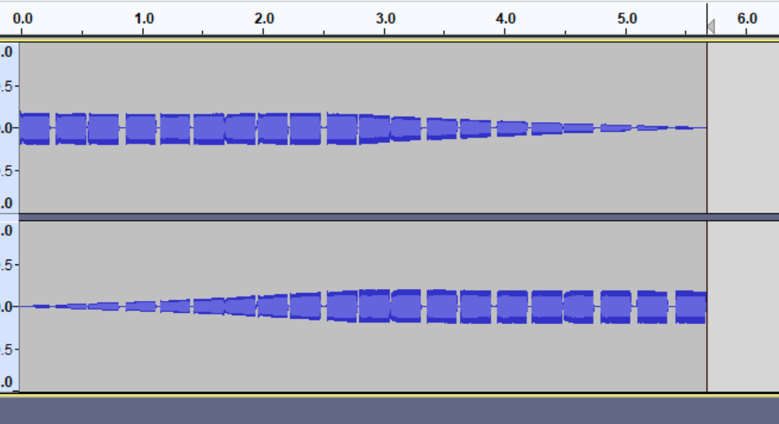

Between each note, there exists a seperation, that happens is random. This makes it impossible to sync graphs together without external tools.

Having a curve go partially out of viewport bounds vertically (so the end points are inside the viewport) such as an inverted parabola yeilds interesting sounds when going out of bounds.
