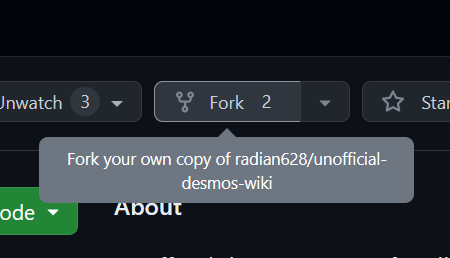
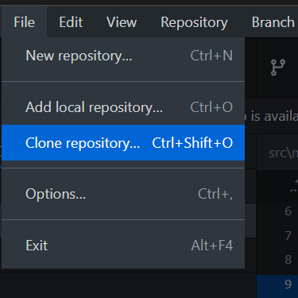
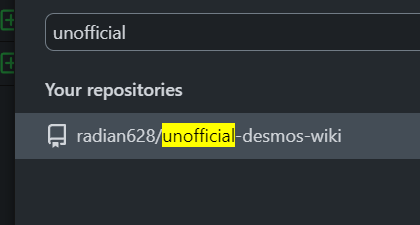
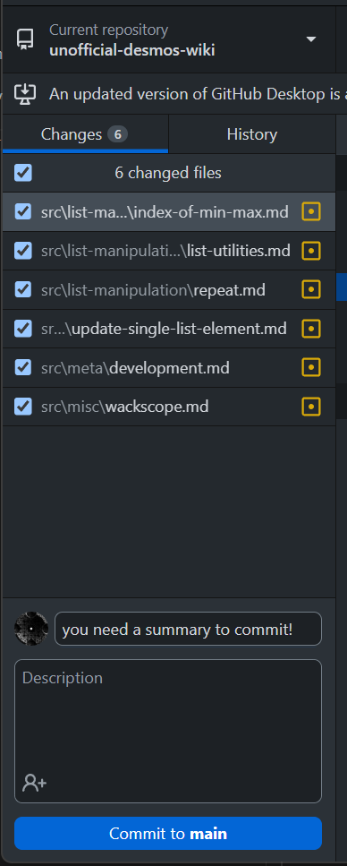
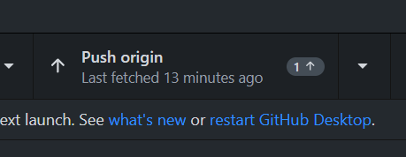

## Where to Contribute

[This GitHub Repository!](https://github.com/radian628/unofficial-desmos-wiki)

## Contribution Philosophy

This site doesn't have very high standards. We'll basically take anything you throw at us, whether that be articles, article ideas, complaints about articles, et cetera. Don't feel the need to ask for permission or dismiss your own ability to write for this wiki. As long as you can imagine someone using your article to help make a Desmos graph or some form of tooling for Desmos, it's 100% welcome here. And if you're not sure, open an [issue](https://github.com/radian628/unofficial-desmos-wiki/issues) here. Even unfinished articles or article ideas are completely fine. [This editing philosophy was inspired by Wikipedia's "Be Bold" policy on edits.](https://en.wikipedia.org/wiki/Wikipedia:Be_bold)

## How to Contribute

This is a guide for how to contribute to the wiki. It's geared toward people with little programming experience, if any. If you're already an experienced programmer and have NodeJS installed, all you really need to know is that:

1. To build it, you need to do `npm i` and `npm run serve`.
2. There's some custom shortcodes and macros and whatnot that this site uses. These are described in the "How do I make a page?" section.
3. Contributions are accepted through PRs and commits to [this GitHub repository](https://github.com/radian628/unofficial-desmos-wiki).

### Prerequisites

- Some form of Git client (If you're not sure, I recommend [GitHub Desktop](https://desktop.github.com/)) for sending over your changes.
- A GitHub account. The site is hosted on GitHub.
- Some kind of code editor for editing the files that make up the website. I recommend [VSCode](https://code.visualstudio.com/) if you're not sure what to choose.
- (REQUIRED for MacOS and Linux, OPTIONAL for Windows) NodeJS and NPM, which can both be installed [by downloading NodeJS from here](https://nodejs.org/).

### Steps to Contribute

The steps below assume that you are using GitHub Desktop. However, if you know what you're doing with Git then that shouldn't matter.

1. Fork [this repository](https://github.com/radian628/unofficial-desmos-wiki). It contains all the code that's used to generate the site.
   
2. Clone the repository.

(note: If you clone your fork, this should say `YOURUSERNAME/unofficial-desmos-wiki` where `YOURUSERNAME` is your GitHub username)

3. Install dependencies. If you're on Windows, run the file `init.ps1`, which will open a terminal that installs NodeJS, NPM, and all the dependencies of the project. It will then generate a local copy the website.
   On any other platform (or if you already have NodeJS and NPM installed), you can alternatively run `npm i` to install dependencies and `npm run serve` to generate the website. This will require that you have NodeJS and NPM installed beforehand (as per the prerequisites listed above)
4. The terminal will tell you where the server is running. This should be a localhost URL&mdash; e.g. http://localhost:8080. Open that URL in your browser to view the local copy of the site.
5. Make your changes. The site in the browser will update to reflect the changes you made. _See the "How do I make a page?" section below for more details on how to make changes._
6. Upload your changes back to your fork on GitHub by committing and then pushing.

7. Submit a [pull request](https://docs.github.com/en/pull-requests/collaborating-with-pull-requests/proposing-changes-to-your-work-with-pull-requests/about-pull-requests).

## How do I make a page?

This site uses [11ty](https://11ty.dev/) for static site generation with the [Liquid](https://shopify.github.io/liquid/) templating engine.

All of the pages that make up the site are [Markdown](https://www.markdownguide.org/) (`.md`) files under the `src` directory. Create a file ending in `.md` there. I recommend looking at other `.md` files to get a sense of the syntax and how it's used.

All files use Markdown for syntax (with HTML support) with YAML Front Matter for site navigation and metadata (e.g. page titles). Learning YAML syntax doesn't matter all that much&mdash; you can probably infer how the Front Matter should look based on how it looks on most pages. Front Matter is the stuff delimited by `---`s at the start of the pages.

### I like to learn by example!

Here's [an example page](../example/) and its [source](https://github.com/radian628/unofficial-desmos-wiki/blob/main/src/meta/example.md).

### Shortcodes

Use shortcodes to embed Desmos content and equations into pages. This wiki uses [11ty-desmos](https://github.com/radian628/11ty-desmos) for embedding Desmos content.

When in doubt, look over other pages to see how they're using the shortcodes.

### Crosslinks

Crosslinks come in two forms: Internal crosslinks, and external crosslinks.

#### Internal Crosslinks

Any page can define a `crosslinks` frontmatter attribute that denotes a list of phrases that will be converted into links to that page fully automatically. As more pages are added, including ones that might have names that correspond to common words, this auto-crosslinking behavior may be revised, with auto-crosslinks being treated more like external crosslinks.

#### External Crosslinks

External crosslinks (crosslinks to other sites) are specified in a `crosslinks.json` file in the root directory of this repository. Any phrase surrounded by double parens which corresponds to a key in `crosslinks.json` will be turned into a crosslink, similar to what Wikipedia does with double brackets (double brackets aren't used here because they mess up Markdown syntax highlighting). As an example, `{{ "((" }}list{{ "))" }}` becomes ((list)).

### Tags

This wiki uses tags to organize pages. See the [main page](/) for a list of all the tags in use. You can also create your own tags if you deem it necessary.

Remember that even if an article you make seems ambiguous, don't overthink tagging. We can always change the tags later if necessary.

There's a few tags in use in this site that have some potential to be confused:

#### Explanation

Use this tag for a page that explains some concept in a more theoretical sense. For instance, the broadcasting article falls into this category because it explains how a more general technique works.

#### Guide

Use this tag for a page that explains some concept in a more practical sense&mdash; The [Guide to 3D](../../3d/) article falls into this category because it walks the user through creating a specific graph.
